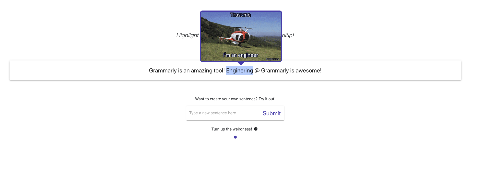

# Getting started
You can also view this project using the URL: https://jenniferyoung02.github.io/giphy-tooltip-challenge/

To bring this up locally, clone the repo than 
`npm install`
`npm start`

You should see the GIPHY Tooltip at `localhost:3000`

# My Thought Process

## Mixed Content: The page was loaded over HTTPS, but requested an insecure XMLHttpRequest endpoint. This request has been blocked.
Uh oh! When I first started with codesandbox, I wanted to see how that environment interacted with axios and fetching from an API. I'm sure glad that was one of the first things I did, because I got was the error 

<code>Mixed Content: The page was loaded over HTTPS, but requested an insecure XMLHttpRequest endpoint'. This request has been blocked; the content must be served over HTTPS.</code>

I browsed the web looking for some quick fixes but did not find any! Turns out modern browsers do this as a security feature. I could go down a wormhole trying to fix this is an unfamiliar environment (code sandbox) or, I could spin up a create-react-app locally and put the project on Github. I choose to do the latter because I would have VSCode (my editor) available to me and I could spend more time developing and less time figuring out the code sandbox environment.

## Selected Text and Tooltip Position

My first puzzle to figure out was how to know the position of the highlighted code so that the tooltip could hover over the appropriate part. At first, I was thinking about wrapping each word in a div with a unique ID and then passing that ID to the tooltip. But I thought that was overpopulating the virtual DOM and didn't feel necessary. I quickly did some research and found that I can use window.getSelection() and e.target.clientX/clientY to get the selected text and furthermore get the coordinates of the selected text.

Originally I tried using clientX but realized that whether I starting highlight from the left or right would really effect the clientX value (because my mouseup would be at different points). I also noticed by only using / clientY, the tooltip was hovering only above the place of mouseUp. I found a method on stack overflow to get specific coordinates of the seleted text, including the left, top and width. I used the coordiantes of the selected text to figure out where the X axis (or the left css property) should be of the tooltip. I used the left + width / 2 to get the x axis of the tooltip, centering around the selected text. I used the coordiantes of top, plus a buffer to determine how far above the tooltip should over.

## Edge cases and glitches

If you selected text and then clicked outside of the content div, the selection would disappear but the tooltip would stay. I quickly realized I had to close the tooltip if the user clicks outside of the div. To do this, I put a listener on the document in useEffect that would compare the click event to the ref of the current div (the GiphyTooltipContent div). If the click event was outside the GiphyTooltipContent, I would trigger handleOutsideClick which would close the tooltip.

If you selected the text and then clicked on the selected text, the window.getSelection() would say that the same text is still selected. Thus, the selection would disappear but the tooltip was still present. I realized the user cannot possibly select the same text. Trying to select the same text will actually trigger a drag event instead. So to correct this action by adding the logic, if the selected text is the same as the previously selected text than close the tooltip.

If you selected on text and then selected on a different part of the text quickly, the previous GIPHY would show up in the new tooltip. To correct for this, I added an isLoading to the FetchGiphy. If isLoading, than no tooltip, will appear.

Originally in FetchGiphy, I had no useEffect. This meant that even if the selected text had not changed, it was slamming the API with the request. I put the fetchData request in useEffect and made a dependency prop of selectedText and weirdnessValue so that it would only trigger an API call if selectedText or WeirdnessValue had changed.

## GIPHY API Interaction

I found the GIPHY docs super easy to use. While I ended up going with the translate endpoint because it was most similar to the prompt, I liked some of the GIPHY's that returned with the search endpoint and I liked the ability to put G rated in the search params (that's the ex-teacher in me!). There are some interesting params in the GIPHY endpoint that were fun to mess around with. Ultimately, I made the API call using axios within a react hook so I could return multiple states and use useEffect with dependencies to only trigger when params changed.

## Why axios?

I did a little research on fetching data from a REST endpoint via React. It's been almost 2 years since doing that as we use Apollo GraphQL. I am not up to date on whether Axios or Fetch is better. Two reasons I decided to go with Axios - one is that it seemed a little simpler in its syntax. The other reason was that it automatically parses the response to json. Both of these things made Axios a preferred method when rapidly developing.

## Why Material UI?

Material UI is a relatively easy library to make things look really professional. I like a lot of it's built-in styling and it really helped rapidly develop without thinking too much about how things would come together in the end.

## Why the new features?

Because I was having fun! I wanted to think through what could make this tool more interesting for the user (I love product engineering!). So adding these fun features is a reflection of my favorite part of engineering - figuring out the technology behind fun and intuitive user experience :)

## How long did you spend on it?

I used all of the allotted time to make sure I completed everything to the best of my abilities.

## What was the most interesting part?

When first given the prompt, I really had to think about how the user would interact with this tool. I love Product Engineering so it was really exciting to me to think about the stying, the experience, and how to make it a fun tool to use. I really had a lot of fun designing and developing this tool, I wanted something that would be fun and easy to use!

I also thought it was really fun to think through the logic of the GIPHY tooltip. It was quite an interesting challenge to think about how to build a tooltip that calls an API and has proper positioning over the highlighted text. I liked thinking through the API endpoint call and the coordinates of the tooltip according to the selected text.

I primarily use GraphQL at work - I was excited to research about fetch and axios to refresh my memory and make the best decision. I liked figuring out the best way to integrate API calls in a React hook.

I have worked with TypeScript only once before; we currently use Flow and our team has been advocating to use TypeScript as there is more support and many libraries are no longer supporting flow. So I was really excited to work with and learn TypeScript.

When I started wrapping up the project, I wanted to add two features. I noticed there was a weirdness key to set in the API. Naturally, I thought "how much fun would it be for the user to choose their weirdness?". My final fun addition was adding the weirdness slider! I also thought it made the most sense for a user to be able to create a custom sentence.

## What else would you add to make it even better?

I would have added a test. I think there could be some Jest test for the components rendering and integration test with the GIPHY API and also a test for the selection. I also find it's human nature to test software in the same ways over and over again. I found many edge cases, but I think the true way to find all edge cases would be to have various people test and try it out to see how others might interact with the tool in ways I would not have thought out. I have a feeling since I'm the only one interacting with the tool that there are glitches and edge cases I am not yet aware of. I would have loved to do A/B testing to see how this works for various users.

As with anything in software, I would have loved to collaborate with another engineer. For example, in the FetchGiphy component, I would love feedback from a more senior engineer on whether the patterns in that component make sense.

I do not like that the API Key is hardcoded. Had this been production, I would have saved this as a GitLab / GitHub variable or some other form of the secret key.

I would have liked to use jss styling in the GiphyTooltip, but for some reason it was conflicting with the FetchGiphy component, causing re-rendering issues. I would have loved to debug further, but for time and simplicity's sake, I used CSS instead.

Note that I included a significant amount of comments to explain my thinking. I understand in production code, best practices is to have meaningful higher-level comments and docstrings. I would minimize the comments had this been production quality coding.